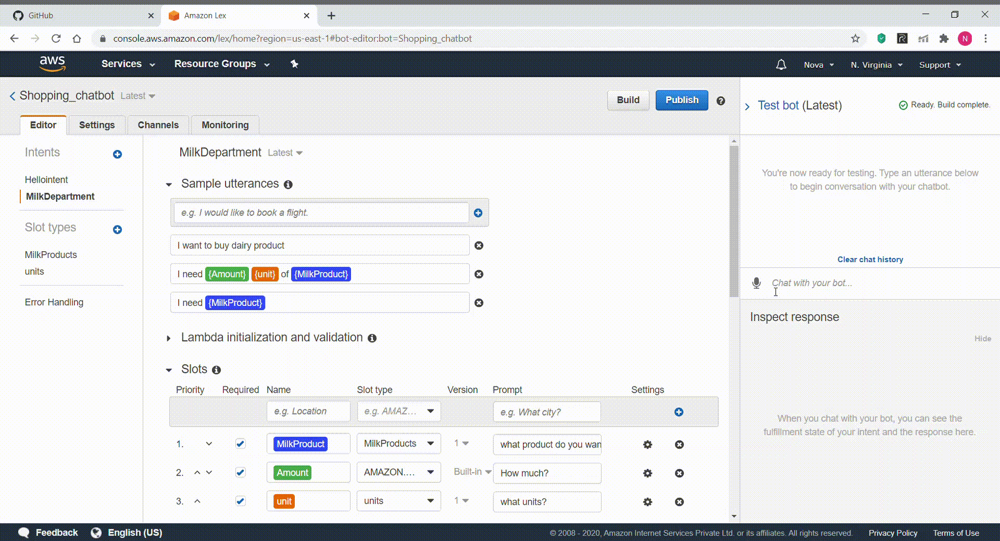

# Shopping chatbot using Amazon Lex
+ This is a shopping chatbot created using Amazon Lex of AWS.

## Description 
+ Amazon Lex is used to build voice and text Chatbots. This shopping chatbot, not only places the user's order but also performs the sentiment analysis of user input data which is positive, negative or neutral. After placing the order, it will show the summary of the user's order.

## Demo

## Things to know to create a chatbot in Amazon Lex
+ Intents
+ Utterances
+ Slots

### Intents
+ A particular goal that the user wants to achieve.
### Utterances
+ Spoken or Typed phrases that invoke your intent.
### Slots
+ The data that the user must provide to fulfill the intent.

